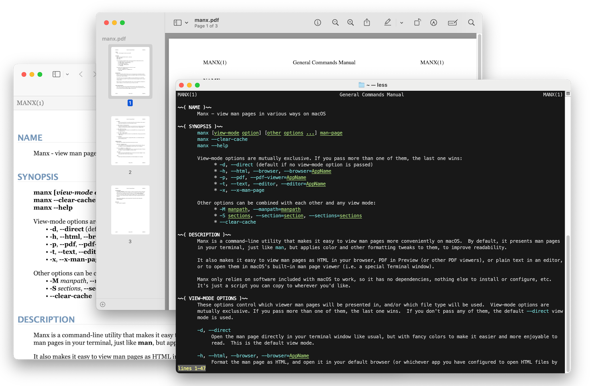

<div align="center">
	
    &nbsp;&nbsp;&nbsp;&nbsp;
	
</div>

## Introduction

**Manx** is a command-line utility that makes it easy to view man pages more conveniently on macOS.  By default, it presents man pages in your terminal, just like man, but applies color and other formatting tweaks to them, to improve readability.

It also makes it easy to view man pages as HTML in your browser, PDF in Preview (or other PDF viewers), or plain text in an editor, or to open them in macOS's built-in man page viewer (i.e. a special Terminal window).

Manx only relies on software included with macOS to work, so it has no dependencies, nothing else to install or configure, etc. It's just a script you can copy to wherever you'd like.

## Usage

Once Manx is installed, you can use it by typing `manx` at a command prompt instead of `man`. By default it behaves just about like man, showing man pages directly in the terminal window and in a pager, but with pretty colors applied. Or, you can request to instead view man pages as HTML, PDF, or plain text.

You can put your default preferences in the `$MANX_OPTIONS` environment variable, then later override them on the command line as needed.

For complete usage info, run `manx --help`, or `manx manx` if you've installed the man page.

## Installation & Uninstallation

To install, download `manx` and put it anywhere convenient that's in your `$PATH`, like `/usr/local/bin`.
Also download the `manx.1` man page and put it somewhere like `/usr/local/share/man/man1`.

```bash
bin_dir="/usr/local/bin";                                     \
[[ -d $bin_dir ]] || sudo mkdir -p "$bin_dir";                \
[[ -w $bin_dir ]] && sudo="" || sudo="sudo";                  \
[[ -L "$bin_dir/manx" ]] && $sudo rm -f "$bin_dir/manx";      \
                                                              \
remote="https://raw.githubusercontent.com/jakshin/manx/main"; \
$sudo curl -fsSL "$remote/manx" -o "$bin_dir/manx";           \
$sudo chmod 755 "$bin_dir/manx";                              \
                                                              \
man_dir="$bin_dir/../share/man/man1";                         \
[[ -d $man_dir ]] || sudo mkdir -p "$man_dir";                \
[[ -w $man_dir ]] && sudo="" || sudo="sudo";                  \
[[ -L "$man_dir/manx.1" ]] && $sudo rm -f "$man_dir/manx.1";  \
                                                              \
$sudo curl -fsSL "$remote/manx.1" -o "$man_dir/manx.1";
```

To uninstall Manx, delete `manx` and `manx.1` from wherever you installed them,
then remove its cache of any HTML/PDF/text versions of man pages it recently generated.

```bash
files=("$(/usr/bin/which manx)") ||                           \
    echo "Didn't find the manx script";                       \
files+=("$(man -w manx 2> /dev/null)") ||                     \
    echo "Didn't find the manx.1 man page";                   \
                                                              \
sudo="";                                                      \
for file in "${files[@]}"; do                                 \
    [[ -w "$(dirname "$file")" ]] || sudo="sudo";             \
    unset file;                                               \
done;                                                         \
                                                              \
$sudo rm -fv "${files[@]}";                                   \
$sudo rm -rf ~/Library/Caches/manx;
```
